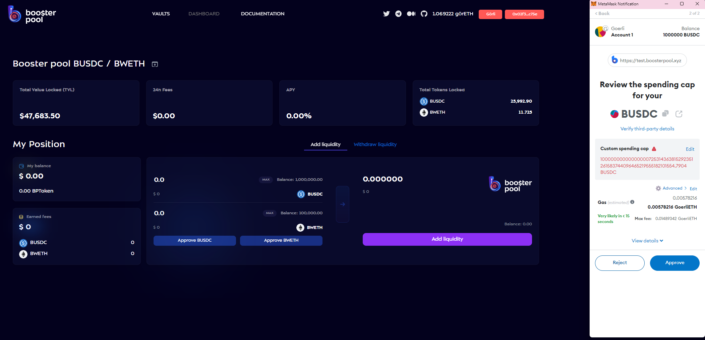

# ↔ ETH<->WETH swap

Uniswap V3 pools use wrapped ETH. To get it, you need to swap ETH->wETH.


Wrapped Ether (WETH) is a token pegged to Ether (ETH). WETH is used in several platforms and DApps that support ERC-20 tokens. While ETH is used to pay for network transaction fees, it doesn't have the same functionality as ERC-20 tokens.

You can easily convert ETH into WETH through a process known as wrapping. You can also convert WETH back into ETH at any time. Both wrapping and unwrapping follow a 1:1 ratio, meaning there are no extra costs apart from transaction fees.


You can wrap your ETH via a booster pool wrapping smart contract, which will store your ETH and give you back the exact same amount of WETH. Use Wrap ETH tab on the pool's page:

.png>)

Enter the amount you want to "wrap" in the input box and click "Wrap ETH". After that MetaMask confirmation window will appear. Click the “Confirm” button.&#x20;


Note that you need to leave a small amount of ETH to pay transaction fees.


.png>)

If you want to get back ETH. You need to click on the arrows and the direction of the exchange will change:

Now you can unwrap your wETH and receive ETH:

.png>)

Let's unwrap some wETH. You need to enter the desired amount of wETH and click "Unwrap wETH". After that the MetaMask confirmation window will appear, you have to click "Confirm":

.png>)

Congratulations, you were able to perform a wrap - unwrap operation for ETH

.png>)
